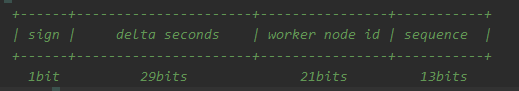

# id-generator-service

`id-generator-service` 产号服务。

1、分布式ID - 基于改造版本的雪花算法生成

> 1）ID长度有64位，等于一个long类型字段的长度；
>
> 2）ID分配规则如下：
>
> 
>
> **sign**: 符号位，也就是最高位为0；
>
> **delta seconds**: 增量秒，长度30位，表示自2019-12-01 00:00:00.000以来的增量秒，可支撑约17年，截至 2036-12-04 18:48:31；
>
> **worker id**: 机器id，长度21位，机器id基于数据库分配，最大机器id约为209W；
>
> **sequence**: 序列号，长度13位，表示同一秒内的序列号，最大值为8191/s；

2、渠道id
> 1、渠道id = 8位分布式ID
>
> 2、8位分布式ID范围 10000000-19999999
>
> 3、长度8位，支持千万级别

3、商户号
> 1、商户号 = 8位分布式ID + 3位后缀
>
> 2、8位分布式ID范围 20000000-29999999
>
> 3、长度11位，支持100亿级别
>
> 举例：后缀为渠道id的后三位，该后缀可以做为分库分表的业务规则(如：100库10表 / 10库100表），方便路由渠道和商户维度对应的库表做查询

4、用户ID
> 1、用户ID = 9位分布式ID + 3位后缀。
> 
> 2、9位分布式ID的范围：9000000000-9999999999
> 
> 3、长度12位，支持1000亿级别
>
> 举例：后缀为商户id的后三位，该后缀可以做为分库分表的业务规则(如：100库10表 / 10库100表），方便路由用户和商户维度对应的库表做查询。

5、订单号
> 1、基于雪花算法生成；
> 
> 2、可指定前缀和后缀；
> 
> 举例：后缀为用户id的后三位，该后缀可以做为分库分表的业务规则(如：100库10表 / 10库100表），方便路由订单和用户维度对应的库表做查询。